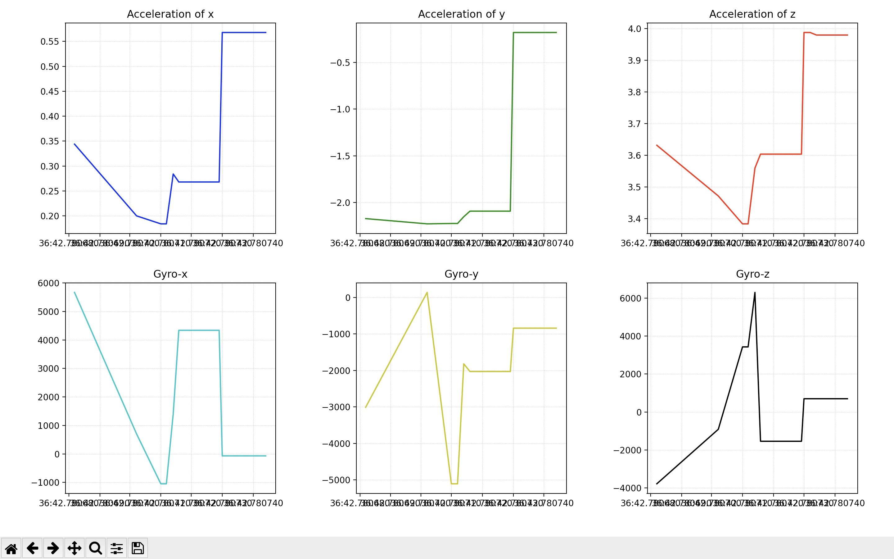

# HW2 WiFi Lab

## 影片與截圖

[Demo影片](https://youtu.be/GKkmx6A7Pis)

)  

## 修改mbed_app.json
```javascript
...
"config": {
        "hostname": {
            "help": "The demo will try to connect to this web address on port 80 (or port 443 when using tls).",
            "value": "\"YOUR_SERVER_IP_ADDRESS\""
        },
        "use-tls-socket": {
            "value": false      //set to true for tls(we don't need now!!)
        }
},
...
"target_overrides": {
        "*": {
            "nsapi.default-wifi-security": "WPA_WPA2",
            "nsapi.default-wifi-ssid": "\"YOUR_WiFi_SSID\"",
            "nsapi.default-wifi-password": "\"YOUR_WiFi_PASSWORD\"",
            ...
        }
}
...
```

## 修改target.json
1. 進入``./mbed-os/targets/targets.json
2. 設置`"printf_lib": "std"`以避免`printf`出現問題

## 修改main.cpp
```javascript
...
class SocketDemo {
    static constexpr size_t MAX_NUMBER_OF_ACCESS_POINTS = 10;
    static constexpr size_t MAX_MESSAGE_RECEIVED_LENGTH = 100;

#if MBED_CONF_APP_USE_TLS_SOCKET
    static constexpr size_t REMOTE_PORT = 443; // tls port
#else
    static constexpr size_t REMOTE_PORT = {YOUR_SERVER_PORT}; // standard HTTP port
#endif // MBED_CONF_APP_USE_TLS_SOCKET
...
```

## How to Run Code
1. `pip3 install {需要的模組}`
2. 運行`GUI-hw2.py`

## 功能介紹
1. `SocketDemo`中的`send_acc_sensor`每秒會傳送一次3D accelerator的資料
2. `SocketDemo`中的`send_gyro_sensor`每秒會傳送一次3D gyroscope的資料
3. 按下藍色按鍵可以toggle是否要傳送資料


## 取得當前LAN中裝置的IP
1. For WiFi: `ipconfig getifaddr en0`

## 注意事項
執行前需要刪除`/b04502136_using_C_hw2`，這部分是另外一位組員透過C與其他語言完成的GUI軟體。
